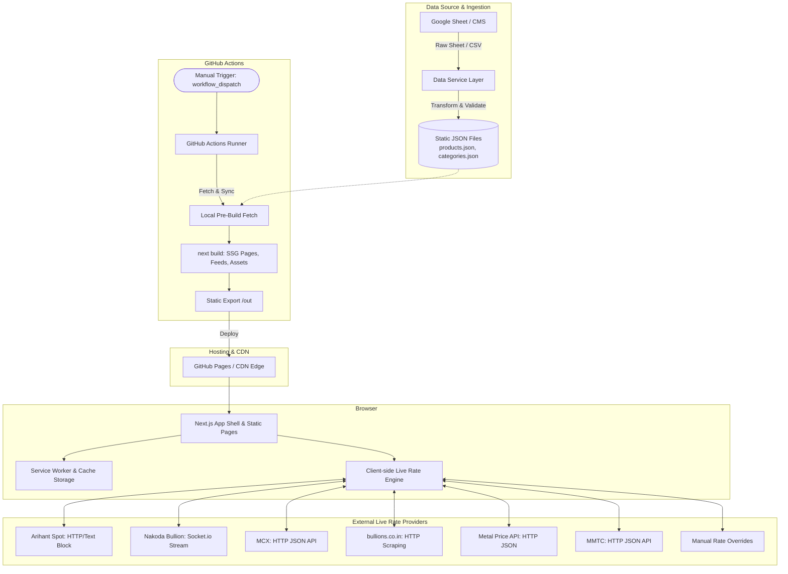
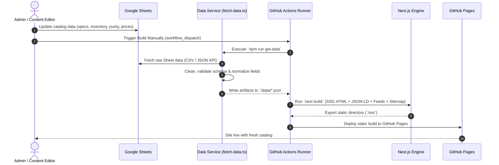

# Architecture – Next.js SSG PWA

## 1. Overview
A high-performance, Static Site Generated (SSG) Progressive Web App (PWA) built using **Next.js**, **React**, and **Tailwind CSS**.

The system utilizes a decoupled data pipeline where catalog and product data originate in **Google Sheets**, undergo transformation via an internal **Data Service** into optimized static JSON artifacts, and are fetched locally before build time. Builds are triggered on **GitHub Actions** (via manual dispatch) and deployed to **GitHub Pages**.

---

## 2. High-Level Architecture

## 3. Logical Architecture & Project Structure

    ├── .github/
    │   └── workflows/
    │       └── deploy.yml              # GitHub Actions manual workflow (workflow_dispatch)
    ├── app/                            # Next.js App Router
    │   ├── (main)/                     # Main UI layout route group
    │   │   ├── layout.tsx              # Application shell layout
    │   │   ├── page.tsx                # Homepage
    │   │   ├── product/[slug]/         # Dynamic Product Details page (SSG)
    │   │   ├── category/[slug]/        # Category listing page (SSG)
    │   │   └── jewelry-type/[slug]/    # Jewelry type listing page (SSG)
    │   ├── sitemap.ts                  # Static sitemap generator (sitemap.xml)
    │   └── gmc-feed.xml/               # Google Merchant Center RSS feed route
    │       └── route.ts
    ├── components/                     # Reusable UI component library
    │   ├── common/                     # Header, Footer, Navigation, App Shell modals
    │   ├── product/                    # ProductCard, PriceBox, Gallery
    │   └── rates/                      # LiveRateTicker, PriceCalculator
    ├── data/                           # Generated/fetched JSON data artifacts
    │   ├── products.json
    │   ├── categories.json
    │   └── types.json
    ├── public/                         # Public assets & PWA configuration
    │   ├── sw.js                       # Service Worker script
    │   ├── manifest.json               # Web App Manifest
    │   ├── static/img/products/        # Optimized WebP images
    │   └── icons/                      # PWA icons (192x192, 512x512)
    ├── scripts/                        # Ingestion & Pre-build scripts
    │   └── fetch-data.ts               # Google Sheets -> Data Service -> Local JSON sync
    ├── utils/                          # Business logic & Price calculation
    │   ├── calculatePrice.ts
    │   └── liveRates.ts
    └── next.config.ts                  # Static export configuration (output: 'export')

### Core Logical Layers

- App Shell & Layouts: Root layout providing global CSS, persistent navigation, SEO schema wrappers, and context providers.
- Pages & Dynamic Routes: Pre-rendered SSG pages generated at build time with SEO meta-tags and JSON-LD schema injection.
- Components: Reusable UI components styled with Tailwind CSS tokens.
- Data Layer: Local JSON artifacts consumed by pages and dynamic routes via generateStaticParams.
- Feeds & Discovery: Automated static endpoints (sitemap.xml, gmc-feed.xml) generated directly during build.

## 4. Routing Strategy & Data Pipeline

### Ingestion & Build Flow

- Google Sheets as Headless CMS: Product managers manage catalog data, metal purity, making charges, weight, and stock status in Google Sheets.
- Data Service Transformation: fetch-data.ts queries the sheet, sanitizes values, validates schemas, and maps rows to typed TypeScript structures.
- Local Fetch Before Build: The ingestion script saves normalized data to local files (@/data/products.json, @/data/categories.json, @/data/types.json).
    - Static Site Generation (next build):
    - Configured with output: 'export' in next.config.ts.
    - generateStaticParams() pre-renders every product and category path into static HTML.
    - Dynamic routes via [slug].
    - Sitemaps (sitemap.ts) and Merchant feeds (gmc-feed.xml/route.ts) are compiled to static XML files.

- GitHub Actions CI/CD: Manual trigger via workflow_dispatch executes the pre-build fetch, runs next build, and deploys /out to GitHub Pages.- 
## 5. PWA Architecture & Browser Runtime

PWA Modules
- Web App Manifest (manifest.json): Defines standalone display mode, background colors, theme branding, orientation, and standard maskable app icons.

- Service Worker (sw.js):

    - Install Phase: Pre-caches the Next.js App Shell, core CSS/JS bundles, fallback offline page, and primary icons.

    - Activate Phase: Automatically deletes outdated cache versions from previous builds.

    - Fetch Strategy (Stale-While-Revalidate): Serves cached assets for instant loading while updating the cache in the background.

- Offline Capability: Fallback strategy ensures catalog browsing remains operational during network dropouts.

## Build & Deployment
- Compilation: next build produces purely static assets in the /out directory.
- CI/CD Execution: GitHub Actions runner triggered manually via workflow_dispatch.
- Hosting: GitHub Pages with global CDN edge delivery and static asset caching headers.

## Key Design Decisions
Live Rate Sources
- Dynamic pricing calculations occur on the client side using real-time rate integrations:

  - Arihant Spot: HTTP call and regex parsing of raw text block.
  - Nakoda Bullion: Event-driven streaming using socket.io for continuous updates.
  - MCX: HTTP call to JSON API endpoint.
  - bullions.co.in: HTTP call with web scraping and DOM extraction.
  - Metal Price API: Authenticated HTTP API call and JSON parsing.
  - MMTC: HTTP API call and JSON parsing.
  - Manual Updates: Admin-defined baseline overrides stored in local configuration/state when provider feeds are unreachable.

## Architectural Principles

- Static Export (output: 'export'): Removes the need for a Node.js server, eliminates runtime vulnerabilities, and allows zero-cost hosting on GitHub Pages.
- Pre-Build Local Ingestion: Fetching Google Sheets into local JSON before next build ensures atomic builds and protects against external API rate limits.
- Manual GitHub Trigger (workflow_dispatch): Gives the operations team total control over deployment timings after batch catalog edits.
- Decoupled Pricing Engine: Combines static product base weights (SSG for SEO) with client-side live rate feeds for real-time price calculations at checkout.
- Feed & JSON-LD Parity: Generates sitemap.xml, gmc-feed.xml, and on-page application/ld+json from identical source JSON to avoid data mismatches across Googlebot and Merchant Center.